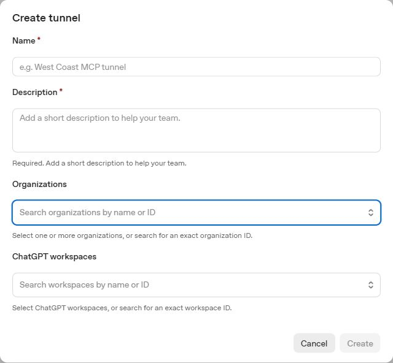
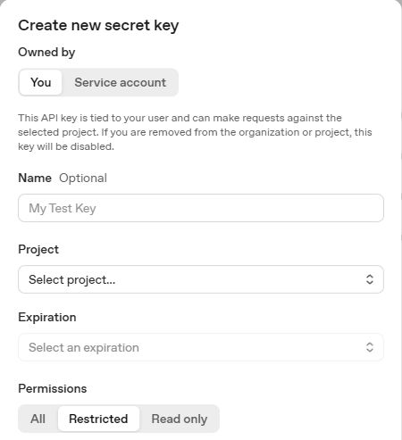
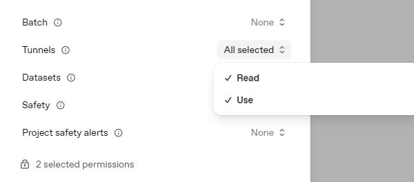
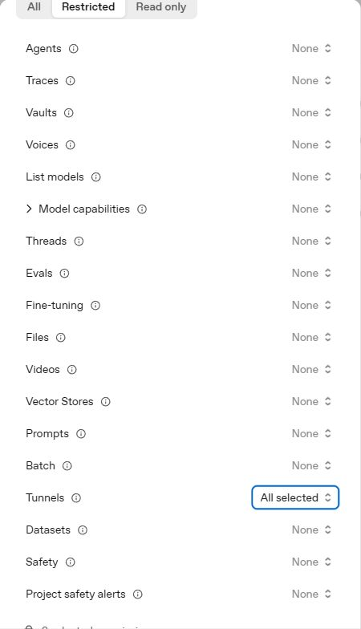
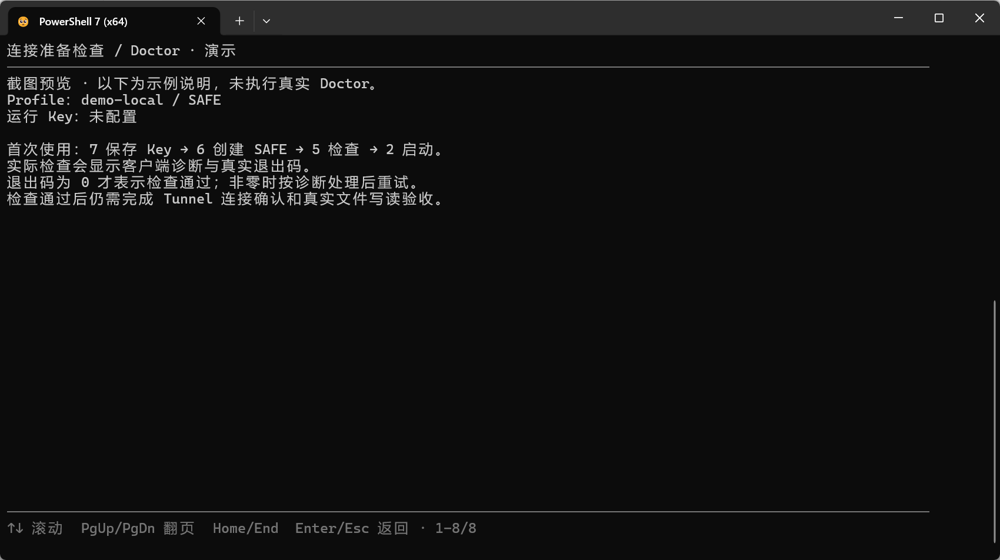
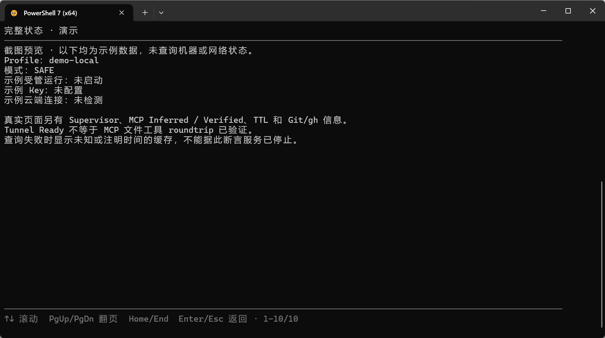
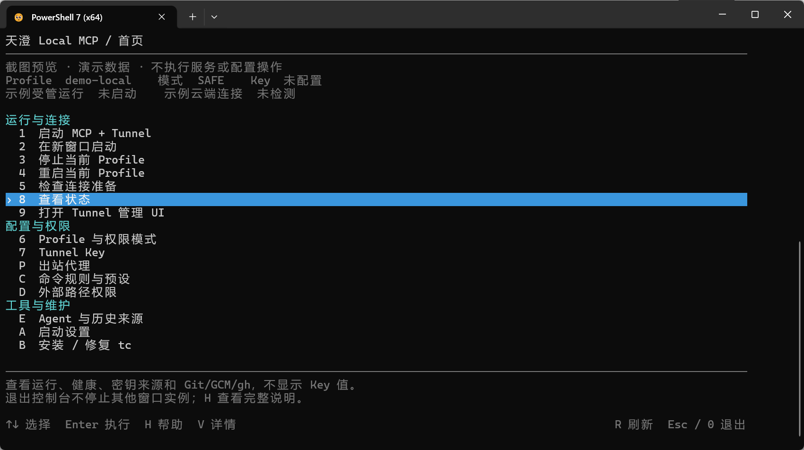

# Windows 从零安装到输入 `tc`

目标：只跟着这一页做，在 **PowerShell 7** 输入 `tc` 就能打开控制台、启动本机 MCP + Tunnel，并让 ChatGPT 实际完成文件写读。

第一次用默认 **SAFE**，它允许工作区文件修改和本地 Git，关闭普通命令、远程 Git和 Agent 运行。进阶能力在最后的菜单说明中按需开启。

依次完成：**安装程序 → 放好仓库和客户端 → 创建 Tunnel 与专用 Key → 配置工作区 → 安装快捷命令 → 保存 Key / 创建 Profile → 检查与启动 → 创建 ChatGPT 插件 → 文件验收**。

已完成安装的用户可直接跳到 [安装快捷命令](#7-安装快捷命令并从新终端验证)、[启动与验证](#9-检查启动并完成-tunnel-验证) 或 [菜单说明](#11-每个主菜单选项能做什么)。首次使用按顺序做即可。

## 1. 安装 PowerShell 7、uv 和 Git

在已有 Windows 终端中安装缺少的程序。Windows 11 通常自带 winget；没有时使用下表的官方安装入口。

```powershell
winget install --id Microsoft.PowerShell --source winget
winget install --id astral-sh.uv --exact
```

| 程序 | 用途 | 官方安装说明 |
| --- | --- | --- |
| PowerShell 7 | 运行控制台及 tc 快捷函数；不是 Windows PowerShell 5.1 | [Microsoft 安装说明](https://learn.microsoft.com/powershell/scripting/install/installing-powershell-on-windows) |
| uv | 下载 Python、创建隔离环境并安装锁定依赖 | [uv 安装说明](https://docs.astral.sh/uv/getting-started/installation/) |
| Git | 本地 Git 查询/提交，以及下载与更新仓库 | [Git for Windows](https://git-scm.com/downloads/win) |

安装 Git 时可使用官方安装器的默认选项。Git 不影响纯文件操作，但未安装时 Git 工具不可用。GCM、gh、Codex 和 Claude 不是首次文件连接的必需项。

安装完成后新开 **PowerShell 7**，检查：

```powershell
$PSVersionTable.PSVersion
uv --version
git --version
```

PowerShell 的 Major 应至少为 7。安装前已打开的终端可能仍使用旧 PATH，需要新开终端。Python 可以交给 uv 安装，无需先手动配置系统 Python。

## 2. 下载项目并选定三个目录

在本仓库的 GitHub 页面点 **Code → Download ZIP**，解压到一个固定位置；熟悉 Git 的用户也可以克隆仓库。后续更新只替换程序源码，保留本机配置与密钥。

需要区分三个位置：

| 目录 | 存什么 | 示例布局 |
| --- | --- | --- |
| 服务仓库 | tc.ps1、源码、.venv、本机配置、密钥和日志 | 一个固定的 TianCheng-MCP 文件夹 |
| 官方客户端 | tunnel-client.exe 及附带文件 | %LOCALAPPDATA%/Programs/OpenAI-Tunnel |
| MCP 工作区 | 要交给 ChatGPT 操作的文件和项目 | 用户目录下的 TianChengWorkspace |

**工作区不能包含服务仓库、客户端或密钥文件。**不要直接用整块磁盘或整个用户主目录作为工作区。

在 PowerShell 7 进入解压后的服务仓库，使用实际目录替换占位值：

```powershell
Set-Location -LiteralPath '<解压后的服务仓库完整路径>'
Get-Item .\tc.ps1, .\install-tc.ps1, .\pyproject.toml
uv python install 3.13
uv sync --frozen --python 3.13
```

最后两条会下载 Python（已有时复用）、创建 `.venv` 并安装项目依赖。不要另外运行 pip 或手动激活虚拟环境。首次联网失败时先检查网络/系统代理，程序尚未安装前无法使用控制台的 P 菜单修复网络。

uv 下载 Python 的行为见 [官方说明](https://docs.astral.sh/uv/guides/install-python/)。

## 3. 下载并放好官方 tunnel-client

从 Tunnel 列表右上角 **Download tunnel-client**，或直接打开 [OpenAI 官方最新发布页](https://github.com/openai/tunnel-client/releases/latest)，展开 **Assets**。

| 电脑架构 | 下载的 ZIP 文件名格式 |
| --- | --- |
| 常见 Intel / AMD Windows 电脑 | `tunnel-client-v<版本>-windows-amd64.zip` |
| Windows ARM 电脑 | `tunnel-client-v<版本>-windows-arm64.zip` |

不确定架构时，在 Windows **设置 → 系统 → 关于 → 系统类型** 查看。这里使用标准 tunnel-client 包；不要下载 Source code，也不需要为本项目选择 runtime 或 runtime-cloudflared 包。链接跟随最新发布，文件名里的版本会变化。

解压整个 ZIP，保留附带文件。已检查官方标准 Windows 包：`tunnel-client.exe` 在解压目录根部。不要在 ZIP 预览窗口里直接运行。

### 解压后的存放位置

建议将整个解压目录放在稳定位置，例如自己的：

```text
%LOCALAPPDATA%/Programs/OpenAI-Tunnel/
    tunnel-client.exe
    cloudflared.exe
    LICENSE
    NOTICE
    ...
```

这是建议位置，不是程序的强制目录。它必须在 MCP 工作区之外；不要放进临时下载目录后再删除或移动。

在 PowerShell 7 查看建议位置并验证程序：

```powershell
$tunnelExe = Join-Path $env:LOCALAPPDATA 'Programs/OpenAI-Tunnel/tunnel-client.exe'
$tunnelExe
Test-Path -LiteralPath $tunnelExe
& $tunnelExe help quickstart
```

`Test-Path` 应返回 `True`，最后一条应显示官方帮助。如果是 False，先查实际解压目录，常见原因是多套了一层文件夹。

首次使用不必修改 PATH。记住上面打印的完整 exe 路径，下一步配置时会使用它。对应 JSON 字段为 `tunnelClient`，例如：

```json
{
  "tunnelClient": "C:/Users/<USER>/AppData/Local/Programs/OpenAI-Tunnel/tunnel-client.exe"
}
```

替换 `<USER>`，或直接使用你实际解压位置；JSON 中推荐正斜杠。若已把 exe 所在目录加入 PATH，可将 tunnelClient 留空。两种方式选一种即可。

## 4. 在 OpenAI 创建 Tunnel

打开 [OpenAI Platform → Organization → Tunnels](https://platform.openai.com/settings/organization/tunnels)，确认选中了准备使用的组织，再点 **Create tunnel**。



截图裁掉了已有 Tunnel 列表，并清空了未提交表单中的个人组织选择；实际创建时必须选择自己的组织。

| 字段 | 填什么 |
| --- | --- |
| Name | 便于辨认的名字，例如 `My Windows MCP`。必填。 |
| Description | 简短用途，例如 `Local workspace MCP on my Windows PC`。必填。 |
| Organizations | 选择拥有或管理这个 Tunnel 的 Platform 组织。可搜索准确的组织 ID。 |
| ChatGPT workspaces | 选择准备使用 MCP 的 ChatGPT 工作区。可按名称或准确的 workspace ID 搜索。 |

确认组织和工作区后点 **Create**，在列表中用 **Copy tunnel ID** 复制 `tunnel_...`，保存供稍后的本机 Profile 配置使用。名称不是 Tunnel ID。

创建/编辑 Tunnel 需要组织级 **Tunnels Read + Manage**；运行客户端与从 ChatGPT 选用 Tunnel 需要 **Read + Use**。这些组织权限与下面 Key 的限制分别生效，不能通过放宽 Key 绕过组织权限。详见 [官方 Tunnel 文档](https://developers.openai.com/api/docs/guides/secure-mcp-tunnels)。

## 5. 创建只允许 Tunnel 的专用 API Key

打开 [Organization → API keys](https://platform.openai.com/settings/organization/api-keys)，点 **Create new secret key**。使用 API keys 页面，不要为这个客户端创建 Admin key。

先确认选中 **Restricted**：



按下面填写：

1. **Owned by**：个人电脑首次使用选 **You**。
2. **Name**：建议 `My Windows Tunnel`，用于辨认和后续撤销。
3. **Project**：选择你有权限使用的项目。Key 的项目选择与 Tunnel 的组织/工作区关联是不同设置。
4. **Expiration**：按页面提供的选项选择适合自己的有效期；到期后客户端需要换 Key。
5. **Permissions**：选 **Restricted**（自定义/受限权限），不要接受默认 **All**。
6. 其他能力全部保留 **None**；找到 **Tunnels**，展开后选择 **Use**。
7. 当前实测页面会自动同时选中 **Read** 与 **Use**，该行显示 **All selected**，底部显示 **2 selected permissions**。这里的 All selected 只指 Tunnels 这一行，不是整个 Key 的 All 权限。
8. 核对只有这两项权限，再点 **Create secret key**，将显示的密钥保存到自己的安全位置。

Tunnels 展开后应同时勾选 Read 与 Use，底部为 2 项权限：



<details>
<summary>查看其他能力均为 None 的完整权限概览</summary>



</details>

这些截图来自未提交的演示表单，没有填写个人项目或生成密钥；实际创建时须选择自己的项目。

权限核对表：

| 设置 | 专用运行 Key 的目标值 |
| --- | --- |
| Permissions | Restricted |
| Tunnels | Read + Use；页面中为 All selected |
| Models、Files、Agents 及其他能力 | None |
| 选中权限数量 | 2 |

这套表单字段和自动勾选行为已在真实 Edge 页面核对。运行文件/Git MCP 不需要给这个 Key 开模型、文件或 Agent API 权限；本地 Agent 的模型凭据另外配置。

不要将完整密钥写进截图、仓库、工作区或聊天。在本项目中通过控制台 **7. API Key 管理** 的隐藏输入保存即可，不要直接放进命令参数。本机 `.env` 保存是明文文件，程序会尝试收紧 ACL。

组织权限的最小授权依据见 [官方权限说明](https://developers.openai.com/api/docs/guides/rbac)。若提示权限不足，分别检查组织角色、Key 的 Tunnels 权限和项目选择。

## 6. 写入本机配置

仍在仓库根目录，创建一个独立的测试工作区并复制配置示例：

```powershell
$demoWorkspace = Join-Path $env:USERPROFILE 'TianChengWorkspace'
New-Item -ItemType Directory -Path $demoWorkspace -Force | Out-Null
if (-not (Test-Path -LiteralPath .\config\launcher.local.json)) {
    Copy-Item .\config\launcher.local.example.json .\config\launcher.local.json
}
$demoWorkspace
$tunnelExe
notepad .\config\launcher.local.json
```

填写 `workspace` 与 `tunnelClient`。下面是一份最小可用示例；将 `<USER>` 替换为自己实际的用户目录，路径不同就填写自己的完整路径：

```json
{
  "workspace": "C:/Users/<USER>/TianChengWorkspace",
  "tunnelClient": "C:/Users/<USER>/AppData/Local/Programs/OpenAI-Tunnel/tunnel-client.exe",
  "powerShell": ""
}
```

也可以保留原示例的其他字段，只修改这两项。JSON 用双引号；路径使用正斜杠，或将反斜杠写为 `\\`。powerShell 留空从 PATH 找 pwsh；找不到时填写 PowerShell 7 的 exe 完整路径。

检查选定配置：

```powershell
pwsh -NoProfile -File .\tc.ps1 -Action info -Json
```

输出的 workspace 和 tunnelClient 应与上面一致。若 workspace 不一致，检查 `TIANCHENG_WORKSPACE`；它会覆盖本机配置。此检查不代表云端已连接。

## 7. 安装快捷命令，并从新终端验证

确认仍在 PowerShell 7 的仓库根目录，执行：

```powershell
.\install-tc.ps1
. $PROFILE.CurrentUserAllHosts
Get-Command tc
```

安装器把带边界标记的 `tc` 函数加入 **当前用户、所有 PowerShell 7 Host** 的 Profile；已有内容保留，重复安装只更新自己的函数块。它不要求把服务仓库加入 PATH。

**再新开一个普通 PowerShell 7 窗口**，不要使用 `-NoProfile`，从任意目录验证：

```powershell
tc -Action info -Json
tc
```

`Get-Command tc` 应显示 Function，tc 应打开控制台。之后无需先切回仓库目录。移动服务仓库后，到新位置重跑 install-tc.ps1，修复快捷函数里的绝对路径。

若提示不允许运行脚本，先执行 `Get-ExecutionPolicy -List`。自己的电脑、且 MachinePolicy/UserPolicy 均为 Undefined 时，可为当前用户设置 RemoteSigned：

```powershell
Set-ExecutionPolicy -Scope CurrentUser RemoteSigned
```

如果 ZIP 下载的脚本仍提示未签名，核实仓库来源后，在仓库根目录解除这些脚本的下载标记，再重试安装：

```powershell
Get-ChildItem -LiteralPath . -Filter *.ps1 -File | Unblock-File
Get-ChildItem -LiteralPath .\scripts -Filter *.ps1 -File -Recurse | Unblock-File
```

组织策略已配置时按组织要求处理。诊断时直接运行 tc.ps1 不等于快捷函数已经安装成功，仍需完成本节的新终端验证。

## 8. 保存 Key 并创建 SAFE Profile

打开 tc 后：

1. 主菜单 **7 → 3**：在隐藏输入中粘贴第 5 步创建的 Tunnel Key，保存到本机 .env，选 0 返回。
2. 主菜单 **6 → 1**：创建本机 Profile。名称可接受默认 `tiancheng-local`；Tunnel ID 填第 4 步复制的 `tunnel_...`。
3. 模式选 **1. 安全默认**；管理 UI 自动打开可先接受默认否。
4. 返回主菜单。已有同名 Profile 时不要误重建，可先选新名称。

Key 的优先级为 **当前进程 → Windows 用户环境 → .env**。状态界面显示来源而不显示值；修改 .env 后仍使用旧 Key 时，先清理高优先级旧值。`.env` 为明文文件，程序会尝试收紧 ACL。

Profile 是保存在本机的启动配置，Tunnel 是 OpenAI 的连接通道；它们不是同一项。这里的 Key 供 tunnel-client 使用，不是模型 Key，也不需要填进 ChatGPT 的认证表单。

## 9. 检查、启动，并完成 Tunnel 验证

先选 **5. Doctor 检查**；通过后选 **2. 在新窗口启动**。这让运行窗口保持连接，当前控制台还能查看状态或退出。也可选 1 在当前窗口前台运行。

下图是公开版预览入口的真实界面截图，使用 `demo-local` 演示数据，**未执行 Doctor，也未查询真实连接状态**。它们用于说明结果页布局；实际使用须以本机诊断、退出码和连接验证为准。





选 **8** 检查运行状态，选 **9** 打开本机 Tunnel 管理 UI，确认健康、就绪与连接情况。UI 默认为本机地址，和 Platform 创建 Tunnel 的网页是两处不同入口。

**必须先让 Tunnel 工具连接并验证通过，保持运行，再到 GPT 网页版创建自定义 MCP 插件。**只填写了 ID 或创建了 Profile 不够。实际踩坑时，顺序反过来可能得到 429 或其他不直观错误；验证后仍失败要继续按返回信息排查。

关闭运行窗口会断开连接。选 0 只退出控制台，不会停止另一窗口运行的 Tunnel；需要停止时用主菜单 3。更改权限、代理或启动配置后用 4 重启，再检查实际状态。

## 10. 在 ChatGPT 创建插件并验证文件工具

确认第 9 步通过后，打开 [ChatGPT Plugins](https://chatgpt.com/plugins)：

1. 加号 → **Add custom MCP server**，填写名称和简介。
2. **Connection → Tunnel**，选择或填入同一个 Tunnel ID。
3. 本 MCP 没有 OAuth 登录，选无需认证的方式；不要粘贴 Tunnel Key。
4. 阅读风险提示 → **Create as a plugin**，确认发现工具。
5. 安装生成的插件，新开对话，用 `@` 选中它。

若找不到 Tunnel，检查关联的 ChatGPT 工作区、Platform 组织以及 Read + Use 权限；ChatGPT 账号/工作区本身也必须允许添加自定义 MCP。见 [官方连接说明](https://developers.openai.com/plugins/deploy/connect-chatgpt)。

发送以下测试请求：

> 调用 workspace_info，告诉我工作区、版本和命令执行是否开启。在工作区新建 connection-check.txt，写入 connected，再用 read_text 读回。若同名文件已存在，先停下来告诉我，不要覆盖。

成功需要同时看到：正确的工作区、命令执行为 false、write_text 成功、read_text 返回 connected，并能在电脑工作区找到文件。仅看到 Ready 或模型说“完成”不算通过。之后可将测试文件移入回收站并验证恢复。

工具/模式更新后，重启服务，在 ChatGPT 连接中 Refresh，再新开对话。

## 11. 每个主菜单选项能做什么

公开版菜单截图如下，使用示例配置并保留“演示数据”标记。名称与快捷命令以实际安装版本为准，操作方式一致。



七个菜单统一采用分组布局：上下键选择、Enter 执行，原数字/字母快捷键也可直接使用。底部灰色提示随选择变化；**H** 查看选项说明，**V** 查看完整状态，**R** 刷新。H/V 不保存配置、不调用模型，返回后保留选择位置。帮助和详情页可用上下键滚动、PgUp/PgDn 翻页、Home/End 到首尾，Enter 或 Esc 返回；长路径自动换行。较小窗口可滚动，重定向或不支持交互的终端会使用文本菜单。

主菜单 **5** 的 Doctor 诊断和 **8** 的完整状态也可分页查看。Doctor 的退出码为 0 才代表检查通过，非零时按诊断处理后重试；检查通过仍需完成第 10 步的真实文件验收。

菜单中的只读子进程探测共用 8 秒预算，成功后显示读取时间。超时或失败时显示“状态未知”；已有快照则标明缓存和上次成功时间，按 R 重试。查询失败不表示服务已停止。

| 选项 | 作用 | 什么时候使用 |
| --- | --- | --- |
| 1 | Doctor 后在当前窗口启动 MCP + Tunnel | 想在前台观察运行；关闭窗口会断开 |
| 2 | 在新窗口启动 | 推荐日常使用；控制台仍可操作 |
| 3 | 停止当前 Profile | 结束受管运行，不删除 Key 或配置 |
| 4 | 停止后在新窗口重启 | 应用已经保存的配置 |
| 5 | Doctor 检查 | 首次启动或连接失败时检查 |
| 6 | 创建/选择 Profile，切换模式 | 多机、多 Tunnel、启用进阶能力 |
| 7 | 管理本机 Tunnel Key | 保存或移除本机 Key；不在网站生成 Key |
| 8 | 运行、健康、Git/GCM/gh 与 Key 来源 | 排查问题；不输出密钥值 |
| 9 | 打开本机 Tunnel UI | 查看已启动客户端的连接情况 |
| A | 程序路径、健康地址、等待时间、自动恢复、TTL | 按顺序询问，回车保留现值 |
| P | 出站代理 | 0 保存返回；8 先保存再联网检测出口 IP |
| B | 安装/修复 tc 快捷函数 | 首次安装或移动仓库后修复 |
| C | 命令白名单与预设 | 每项即时保存，重启生效；不会打开 DEV |
| D | 外部路径访问策略 | 配置工作区之外目录的权限 |
| E | Agent 历史来源、索引与 smoke | 使用本机 Codex/Claude 后再配置 |
| H | 当前菜单的选项说明 | 不清楚选项时当场查询 |
| 0 | 退出或返回上一级 | 不会自动停止另一窗口运行的 Tunnel |

## 12. 进阶能力按需要启用

- **普通命令 / 远程 Git**：6 → 5 切换 DEV，明确确认后重启；远程 Git 还需自己的 Git 登录。C 管理允许命令，minimal 为精确版本查询，balanced 为开发命令，elevated 为显式 Shell，unrestricted 为命令不设限；这些都不提权或提供 OS sandbox。
- **外部文件**：D 添加所需路径规则，6 → 6 开启 GRANTS；需要外部命令则 6 → 7 并明确确认。改路径规则后 reload 或重启。browse 只能列目录，read 允许读，write 允许写，执行权限独立。
- **Agent**：先安装原生 CLI 并配置登录/模型访问，再开启 DEV。E 只管理历史 metadata 来源和验证；第 7 项真实 smoke 会消耗额度且需二次确认。来源索引不是自动授予文件权限。
- **代理**：P 的 1/2 对应请求目标 HTTP/HTTPS；同一 HTTP 代理可分别填给两项。0 保存或8保存并检测后，新检测马上生效，已运行的 MCP/Tunnel 仍需重启。菜单显示配置来源，不需要为了保存代理重新开终端。

更细的配置与边界见 [权限手册](permissions.md)、[Agent 手册](agents.md) 和 [运行维护](operations.md)。这些是参考，不是完成本页首次连接的必经步骤。

## 卡住时按失败步骤排查

| 问题 | 先检查 |
| --- | --- |
| tc 找不到 | 是否 PowerShell7、是否安装到其 CurrentUserAllHosts Profile、是否用了 NoProfile；重开终端或加载 Profile |
| 移动仓库后 tc 失效 | 在新位置重跑安装器，不要手工反复追加函数 |
| 启动器找不到 Python | 仓库根目录 uv sync 是否成功，.venv/Scripts/python.exe 是否存在 |
| 找不到客户端 | tunnelClient 是否指向解压后真实 exe；检查多套了一层文件夹 |
| Key 或权限错误 | 专用 Key 是 Restricted/Tunnels Read+Use；检查旧 Key 来源和有效期 |
| 工作区不一致 | 本机 JSON 与 TIANCHENG_WORKSPACE 是否冲突 |
| 端口占用 | 先用8查运行状态，停止当前Profile；不要自动结束未知占用进程 |
| Tunnel/插件创建失败 | 确认先启动验证Tunnel，再创建插件；检查工作区关联和账号权限 |
| 某菜单能力不可用 | Git/gh/Agent 是外部依赖；先安装登录，再检查对应模式和策略 |

更多排错见 [常见问题](troubleshooting.md)。
